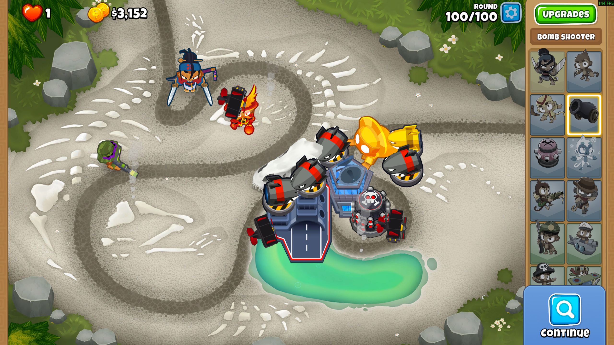
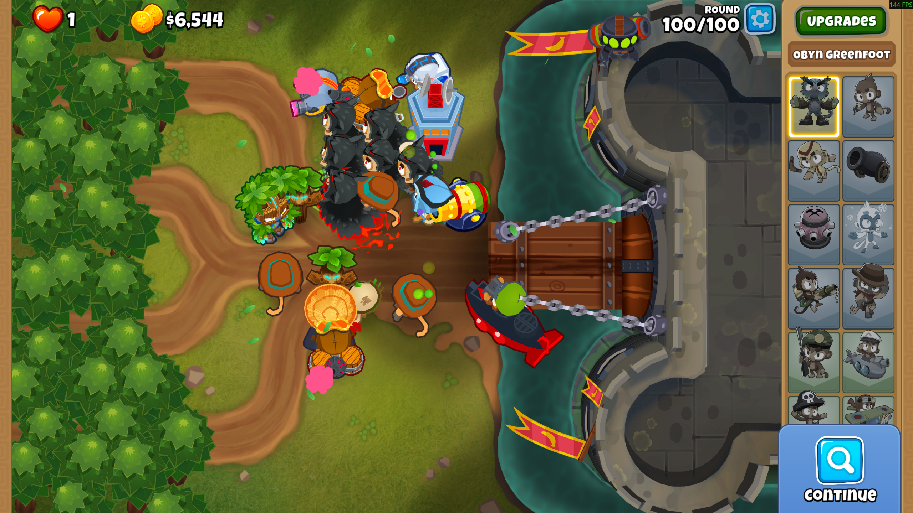
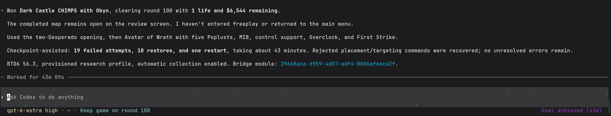
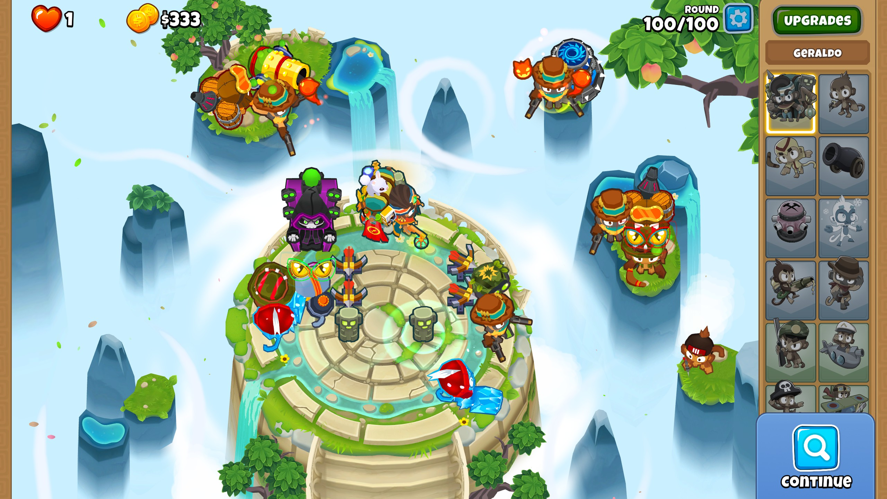

# BTD6 MCP Mod

Let AI agents play Bloons TD 6 through direct game-state inspection and native game actions, rather than computer vision and mouse clicks.

The project consists of two parts:

- **AgentBridge**: A C# mod loaded by MelonLoader that inspects game state and executes actions directly on the game thread.
- **btd6-mcp**: A local TypeScript [Model Context Protocol](https://modelcontextprotocol.io/) server that exposes those reads and commands as MCP tools for Claude Code, Codex CLI, Antigravity, and other compatible agent harnesses.

```text
Agent harness  ← stdio MCP →  btd6-mcp  ← local JSON mailbox →  AgentBridge  ↔  BTD6
```

The AI model decides the strategy, while the bridge handles game communication. No model or LLM provider API is embedded in the mod. The MCP server runs outside the game process and communicates via local files rather than open network ports.

## Why BTD6?

Bloons TD 6 is a great benchmark for long-term planning and tactical adaptation. A CHIMPS game runs through round 100, requiring the model to balance surviving the current wave against saving cash for expensive late-game upgrades. Selling towers is disabled in CHIMPS, so misallocated cash early on can quietly ruin a run dozens of rounds later.

It also tests how well models diagnose and recover when defenses leak. Tower placement, targeting priorities, damage types, and ability timings all matter; simply buying more raw DPS is rarely enough. Checkpoint-assisted runs let models inspect why a round failed and try alternate defenses, while unassisted runs test whether they can plan ahead accurately without retries.

## What agents can do

- **Inspect and run matches.** Check cash, lives, rounds, placed towers, heroes, abilities, and active UI blockers. Start matches, step through single rounds or batches with custom stop conditions, adjust game speed, and return to the main menu.
- **Map geometry and placement.** Read track graphs, branching paths, obstacle bounds, and tactical map renders. Query native-validated tower placement spots, range circles, and line-of-sight obstacles using simulation coordinates instead of screen pixels.
- **Tower placement and micro.** Place, upgrade, and sell towers. Adjust targeting priorities, set custom flight paths or patrol waypoints (Ace and Heli), merge Beast Handlers, and clear removable map obstacles. All actions respect standard in-game cost and mode rules.
- **Scheduled actions and ability timing.** Trigger abilities on demand or schedule them against the simulation clock (including targeted abilities). Queue upgrades to purchase at a specific time or automatically when cash becomes available.
- **Stats and income projection.** Inspect effective tower damage, attack speed, pierce, active buffs/debuffs, and popping capabilities. Project future cash, auto-collect bananas and supply drops, collect bank balances, and evaluate Temple sacrifices or Paragon degrees.
- **Hero micro (Geraldo & Corvus).** Browse Geraldo's shop inventory, check item availability, and purchase items immediately or on schedule. Manage Corvus's mana, cast spells, and toggle continuous spells.
- **Checkpoints and retries.** Save and restore game states between rounds to iterate on difficult rounds without replaying from round 1. Checkpoint archives can also be exported and imported across game sessions.
- **Sandbox testing.** Spawn custom waves, clear bloons, test interactions, pause simulation, or adjust round numbers for mechanics experiments.
- **Boss encounters.** Track active boss health, skull thresholds, immunities, and active phases.
- **Account provisioning.** Instantly unlock all towers, heroes, upgrades (including Paragons), and all maps and game modes (including CHIMPS) via Mod Settings to make setting up an alt account effortless.

The MCP server logs all tower purchases, round results, and restores to local action journals for post-run review. See the [tool reference](btd6-mcp/README.md) for full parameter details.

## Notable model achievements

These are individual test runs, not a comprehensive model leaderboard or unassisted black-border clears.

| Model | Harness | Result |
| --- | --- | --- |
| GPT 6 Astra | Codex | Beat **Dark Castle CHIMPS** (Expert) and **Off The Coast CHIMPS** (Advanced). Reached round 100 on **Party Parade CHIMPS** (Advanced). |
| GPT 5.6 Luna | Codex | Beat **Spa Pits CHIMPS** (Beginner) and **Streambed CHIMPS** (Intermediate). |
| Gemini 3.8 Flash | Antigravity CLI | Beat **Off The Coast CHIMPS**, **Cornfield CHIMPS**, **Ascent CHIMPS**, and **Enchanted Glade CHIMPS** (all Advanced). |

All listed runs used checkpoint assistance. Models were allowed to search the web for strategies and choose their own heroes and build orders. Human input was limited to opening-round placement hints on the hardest maps (Dark Castle, Party Parade).

## Screenshots

All runs shown below used checkpoint assistance.

### GPT 5.6 Luna: Streambed (Intermediate)

**Codex · Sauda · CHIMPS · Round 100/100.**



### GPT 6 Astra: Dark Castle (Expert)

**Codex · Obyn Greenfoot · CHIMPS · Round 100/100.** Checkpoint-assisted; the CLI summary below records retries and restores.



**Codex CLI completion summary** for the same Dark Castle run:



### Gemini 3.8 Flash: Ascent (Advanced)

**Antigravity CLI · Geraldo · CHIMPS · Round 100/100.**



## Before installing

### Account safety and alt accounts

**Always use a dedicated alt account for modding.** Keep modded clients away from public multiplayer and competitive modes (Contested Territory, Races, Boss leaderboards), as modded clients will get flagged. Running BTD6 in an isolated Wine/Proton prefix will not protect your main account if both use the same Ninja Kiwi login. This is an unofficial community project and is not affiliated with Ninja Kiwi.

To make testing on an alt account easy without hours of manual grinding, the mod includes built-in **account provisioning controls**:
- Unlocks all towers and heroes immediately.
- Unlocks all tower upgrades, including Tier 5s and Paragons.
- Unlocks all maps and difficulty modes (including CHIMPS).

You can trigger this at any time in-game via **Mods > Mod Settings > AgentBridge > Provision profile** (or through the bridge protocol).

### Prerequisites

The verified environment is **BTD6 56.3 + MelonLoader 0.7.3 + BTD Mod Helper 3.6.8 on Linux/Proton**.

You will need:

- A Steam copy of BTD6.
- MelonLoader and BTD Mod Helper (setup instructions below).
- The **.NET SDK specified in [`global.json`](global.json)** (currently 10.0.400 with roll-forward). The mod targets .NET 6.
- **Node.js 20+**, npm, and Git.
- An MCP-compatible agent harness with your preferred model configured.

Commands below assume a Bash shell. On Windows/PowerShell, adjust paths and run multi-line commands on a single line.

## Installation

### 1. Install MelonLoader

1. In Steam, right-click BTD6 and select **Manage > Browse local files**. Make sure the game is closed.
2. Follow the [official MelonLoader installer guide](https://github.com/LavaGang/MelonLoader#how-to-use-the-installer) and select `BloonsTD6.exe` (tested with version **0.7.3**).
3. Install the required runtimes, including the **.NET 6 Desktop Runtime** for IL2CPP games. (This is separate from the .NET SDK used to compile the mod).
4. Launch BTD6 once so MelonLoader can generate its folders (`MelonLoader`, `Mods`), then exit the game.

**Linux/Proton:** Follow MelonLoader's [Linux instructions](https://melonwiki.xyz/#/README?id=linux-instructions). Make sure to install the Windows .NET runtime directly into the Proton prefix used by BTD6. Add the DLL override to your BTD6 Steam launch options:

```text
WINEDLLOVERRIDES="version=n,b" %command%
```

If you use a custom prefix, also include `STEAM_COMPAT_DATA_PATH` in the launch options so the game and loader always use the same prefix.

### 2. Install BTD Mod Helper

1. Download `Btd6ModHelper.dll` from the [BTD Mod Helper releases](https://github.com/gurrenm3/BTD-Mod-Helper/releases) (tested with version **3.6.8**).
2. Place `Btd6ModHelper.dll` inside the game's `Mods` folder.
3. Launch BTD6 and confirm the **Mods** button appears on the main menu, then exit. See the [Mod Helper install guide](https://github.com/gurrenm3/BTD-Mod-Helper/wiki/Install-Guide) if you run into issues.

### 3. Build and install AgentBridge

If a [release](https://github.com/ClosetPie107/btd6-mcp-mod/releases) provides `AgentBridge.dll`, download it and copy it into the game's `Mods` folder with the game stopped. You do not need the .NET SDK or Mod Helper source checkout for a prebuilt DLL. Use the matching adapter ZIP from that same release as described below. The source-build alternative follows.

Clone this repository:

```bash
git clone https://github.com/ClosetPie107/btd6-mcp-mod.git
cd btd6-mcp-mod
```

You will also need the [BTD Mod Helper source code](https://github.com/gurrenm3/BTD-Mod-Helper/tree/3.6.8) (version 3.6.8) for its `BloonsTD6 Mod Helper/btd6.targets` build file; the compiled DLL alone is not sufficient to build against.

From the repository root, build the C# project:

```bash
dotnet build AgentBridge/AgentBridge.csproj -c Release \
  -p:BloonsTD6="/absolute/path/to/BloonsTD6" \
  -p:ModHelperTargets="/absolute/path/to/BTD-Mod-Helper/BloonsTD6 Mod Helper/btd6.targets"
```

The game path must point to your BTD6 directory containing `MelonLoader/Il2CppAssemblies` and the installed Mod Helper DLL. On Linux, use standard Linux filesystem paths.

Once built, copy `AgentBridge/bin/Release/AgentBridge.dll` into your game's `Mods` folder alongside `Btd6ModHelper.dll`.

Launch BTD6 and check `MelonLoader/Logs` to verify AgentBridge loads cleanly. Reach the main menu and accept any initial mod prompts. Note that updating the DLL requires restarting the game.

### 4. Build the MCP server

For a prebuilt release, extract `btd6-mcp-<version>.zip` into a permanent directory and run `npm ci --omit=dev` there. Configure your harness to run that directory's `dist/index.js`. Node.js and npm are still required; Git, TypeScript compilation, and the .NET SDK are not. Keep the DLL and adapter from the same release together. The source-build alternative follows.

From the repository root:

```bash
npm --prefix btd6-mcp ci
npm --prefix btd6-mcp run build
```

This compiles the server to `btd6-mcp/dist/index.js`.

Locate the bridge IPC directory created by the mod, usually:

```text
<BTD6 installation>/UserData/AgentBridge/ipc
```

Set **`BTD6_AGENT_BRIDGE_IPC_ROOT`** in your harness configuration to this directory. On Linux/Proton, use the Linux path accessible by Node, not a Wine drive-letter path.

## Connect an agent harness

Your harness launches the MCP server directly over stdio, so no separate background process is needed. BTD6 must be running with AgentBridge loaded for game tools to work.

### Claude Code

Add the server to your Claude Code configuration:

```bash
claude mcp add btd6 --transport stdio --scope user \
  --env BTD6_AGENT_BRIDGE_IPC_ROOT="/absolute/path/to/BloonsTD6/UserData/AgentBridge/ipc" \
  -- node "/absolute/path/to/btd6-mcp-mod/btd6-mcp/dist/index.js"
```

Use `--scope user` to make it available across projects, or `--scope local` to limit it to the current directory.

Run `claude mcp get btd6`, then open Claude Code and run `/mcp` to verify the connection. See [Claude Code's MCP documentation](https://code.claude.com/docs/en/mcp).

### Codex CLI

Add the server to Codex:

```bash
codex mcp add btd6 \
  --env BTD6_AGENT_BRIDGE_IPC_ROOT="/absolute/path/to/BloonsTD6/UserData/AgentBridge/ipc" \
  -- node "/absolute/path/to/btd6-mcp-mod/btd6-mcp/dist/index.js"
```

Because running multiple rounds can exceed default tool timeouts, add `tool_timeout_sec` to the server definition in `~/.codex/config.toml`:

```toml
[mcp_servers.btd6]
command = "node"
args = ["/absolute/path/to/btd6-mcp-mod/btd6-mcp/dist/index.js"]
tool_timeout_sec = 3600

[mcp_servers.btd6.env]
BTD6_AGENT_BRIDGE_IPC_ROOT = "/absolute/path/to/BloonsTD6/UserData/AgentBridge/ipc"
```

Run `codex mcp list`, then use `/mcp` inside Codex to verify the setup. See [Codex's MCP documentation](https://developers.openai.com/codex/mcp).

### Other MCP hosts

Configure a **local stdio** server with:

- **Command:** `node` (or the full path to your Node binary).
- **Arguments:** the absolute path to `btd6-mcp/dist/index.js`.
- **Environment:** `BTD6_AGENT_BRIDGE_IPC_ROOT` pointing to the bridge's `ipc` directory.

No port or network configuration is required. Grant tool permissions as appropriate for your setup, keeping in mind that certain tools can purchase towers, start games, or overwrite save states.

## First run

Start with a quick status check:

> Use `btd6_status` to check the connection. Don't start or replace a match yet.

Before running games, point the agent to the bundled [gameplay guide](btd6-mcp/PLAYING.md) (also available via the `btd6://guides/playing` MCP resource):

> Read the BTD6 playing guide, then start Logs on Hard Standard with Sauda. Use checkpoints to retry failed rounds, but don't use round-setting or round-advancement research controls. Play to victory and report any restores or other assistance used.

If you prefer a strictly unassisted run, configure `checkpointPolicy: "none"` and instruct the agent not to restore checkpoints or alter rounds. Automatic banana/crate collection is enabled by default; disable it if you want the agent to collect drops manually.

If you are playing on a fresh alt account, open the in-game Mod Settings for AgentBridge and click **Provision profile** to unlock all maps, modes, and tower upgrades right away.

When updating the C# mod code, recompile the DLL and restart BTD6. When updating the TypeScript MCP server, run `npm run build` and restart or reconnect the harness.

## Further reading

- [MCP tool reference and troubleshooting](btd6-mcp/README.md)
- [Gameplay guide and run-reporting rules](btd6-mcp/PLAYING.md)
- [Bridge protocol](protocol/v1.md)
